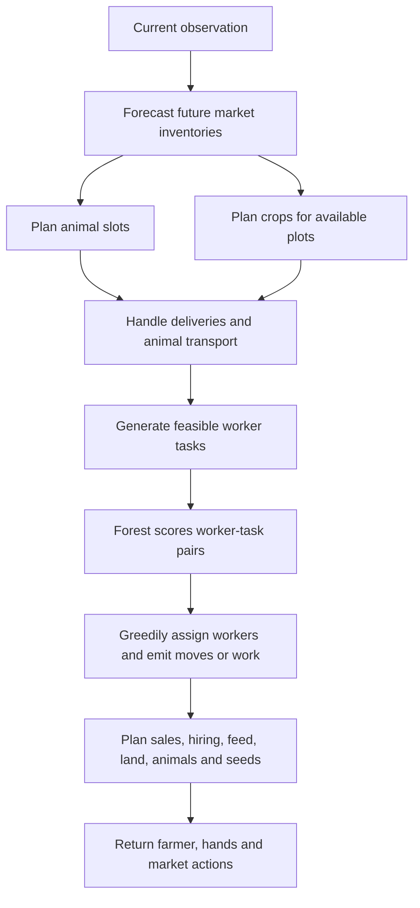

# Understanding v18 and developing v19

This guide explains the code embedded in [the submitted v18 notebook](../submission_nb/kaggriculture-sub_v18.ipynb), its development evidence, and a repeatable workflow for your next version. It documents the local files checked on 2026-09-15. Your reported Kaggle performance is separate from the local measurements below.

**V18 is a hybrid policy:** hand-written economic planning chooses crops and animals; hand-written rules generate feasible worker tasks; a supervised random forest ranks those tasks; hand-written logistics and market rules turn the choices into actions. There is no reinforcement-learning training loop in v18.

Read sections 1–4 to understand the agent, 5–7 to reproduce and interpret experiments, and 8–10 to build v19. You can begin v19 by changing one planning rule without retraining the forest.

## 1. Which files are authoritative?

| File | Purpose |
|---|---|
| [v18 notebook](../submission_nb/kaggriculture-sub_v18.ipynb) | Submitted notebook; writes `main.py`, then packages it |
| [v18_main.py](../submission_nb/v18_main.py) | Readable source equivalent to the notebook's agent cell |
| [v18_submission.tar.gz](../submission_nb/v18_submission.tar.gz) | Archive containing `main.py` |
| [v18_package.json](v18_package.json) | Original package provenance |
| [v18_c258_compiled.py](v18_c258_compiled.py) | Selected development candidate; executable code matches the submitted agent |
| [train_v18_tasks.py](train_v18_tasks.py) | Demonstration extraction, forest training, and uncompiled policy export |
| [compile_v18_forest.py](compile_v18_forest.py) | Converts exported tree arrays into ordinary Python branches |
| [arena.py](arena.py) | Full official-environment runner, including agent file loading |
| [evaluate_v18.py](evaluate_v18.py) | Fast saved-loss evaluation, or live evaluation specifically against v17 |
| [bench_v16.py](bench_v16.py) | Fast interpreter runner supporting an explicit live opponent |

The extracted submitted source SHA256 is:

```text
0360b1ac193e3606a4f28e39c8f19831ed17e76419435e4159ee4d1136d03acd
```

The compiled development candidate has a different file hash because its opening description differs. Comparing Python syntax trees after removing that description confirms identical executable code.

The package's old `development: goal incomplete` label records the earlier ambition to win all 17 saved cases. It does not mean packaging failed. The submitted version won 15 of those cases locally.

**Preserve the submitted files.** [package_v18.py](package_v18.py) overwrites the v18 source, notebook, and archive. [checkpoint_v18.py](checkpoint_v18.py) regenerates an older candidate. Neither is a v19 packaging command. The frozen older policy is [v18_checkpoint79_main.py](v18_checkpoint79_main.py); its 40/40 result must not be attributed to the submitted policy.

## 2. The game as an engineering problem

The default local test uses 720 observation steps and 719 action transitions. Days and hours are zero based: days 0–29, normally 24 turns per day, with the last actionable observation at day 29, hour 22. Final money determines the local reward. A productive asset or an unsold crop has no useful terminal value unless converted into money in time.

Each observation supplies public farms, worker positions, crops, livestock, town shops, and market information, plus your own private seeds, shed, and worker inventories. Opponent private inventories are unavailable to the live policy. Downloaded replays contain additional information that can be used offline for analysis and training, but it must not become a runtime input.

Each turn returns:

```python
{
    'farmer': ['PASS'],          # one movement or work action
    'hands': [['PASS'], ...],    # one action per current hired hand
    'market': [['SELL', 'MILK', 2], ...]  # at most ten orders
}
```

Workers must travel to a tile before working there. Seeds are shared; feed and fertilizer must be carried. Hired hands disappear at night and must be hired again. Nightly inventory delivery can overflow the shed. Sales need goods in the shed; worker actions occur before market processing, so same-turn delivery and sale can work.

These mechanics create four coupled constraints:

1. **Capital:** buying land, animals, seeds, feed, and daily labor competes for cash.
2. **Time:** travel, planting, watering, feeding, harvesting, and delivery compete for worker turns.
3. **Market capacity:** both players' sales affect prices; more production can reduce the value of your other production.
4. **Horizon:** late investments may mature after the game ends, and late harvests may never reach storage.

For example, a melon looks attractive at today's price. Its seed costs money now, it occupies land for many days, it needs worker attention, and its sale competes with other melons later. V18 therefore estimates future supply rather than simply choosing the highest current selling price. The estimate is imperfect: future opponent decisions and shops are not known.

## 3. Read the code in this order

Start with `agent` at the bottom of [v18_main.py](../submission_nb/v18_main.py), then follow its calls. Skip the enormous `_tree_*` expressions until you understand the surrounding pipeline.



The policy replans on every observation. A selected distant task produces one movement step, not a committed multi-turn route. The next observation can change that worker's destination.

### Constants and geometry

`CROPS` stores policy assumptions as `(seed_cost, base_price, harvest_events, target_last_age)`. Harvest events are `(age, expected_units)` pairs. These are planning approximations, not a complete copy of engine rules. In particular, the scheduler harvests wheat earlier during the opening than the normal event table assumes.

| Crop | Seed cost | Planned events in the table |
|---|---:|---|
| Wheat | 10 | Age 4: four units |
| Carrot | 20 | Age 3: three units |
| Tomato | 50 | Ages 8, 9, 10, 11: two units each |
| Strawberry | 100 | Ages 10, 12, 14, 16: two units each |
| Melon | 80 | Age 10: six units |

`ANIMALS` stores `(purchase_cost, product, first_production_age, interval, expected_units)`: cow `(400, MILK, 8, 2, 3)`, sheep `(500, WOOL, 6, 3, 4)`, goose `(300, EGG, 4, 1, 2)`. These expected yields assume useful care; buying an animal does not guarantee them.

`SHOPS` translates shop types into product demand. Repeated wool/carrot entries represent the greater consumption of the single-product shops. `ROUTES` defines compact livestock coordinates near storage; the current code uses these coordinates as candidate slots, not as fixed worker patrol routes. `ANIMAL_POINTS` reserves those coordinates from crop planning. `SHED` lists storage-access coordinates. `PASS` is the no-op action.

`dist` is Manhattan distance. `move` takes one step toward a destination, preferring the horizontal axis on a tie. `nearest_shed` selects the closest access point. `tile` converts `(x,y)` to `tiles[y][x]`. `totals` combines shed and worker inventories; it does not count seeds or goods still on plants.

### `price`: estimate value from market inventory

This function implements product-specific price curves around inventory 10,000, including shortages, surplus penalties, and a minimum price. It supports hypothetical future prices. Actual market orders use the observed prices instead.

The implication is marginal value: adding another sheep can depress wool revenue from your existing sheep. A constant sale-price assumption would miss that interaction. Recheck these formulas against the installed engine if its version changes.

### `forecast`: estimate future supply and demand

The function builds a 31-entry projected inventory array for each product. It starts from current market inventory, adds visible production from both farms and your held goods, subtracts town consumption, and includes herd feed demand for wheat. It approximates future shop demand using the average shop mix.

The return value is `(projected, demand)`. `agent` uses `projected`; the returned `demand` is presently unused there. This is an analytical model, not a learned world model or a simulation of every future action. It can overestimate production when watering, care, harvest capacity, or delivery fails. It also does not predict the opponent's new investments.

### `animal_plan`: choose incremental livestock investments

Existing animals and animals already purchased take priority. New expansion is considered on days 3–17, in unlocked reserved slots, up to `HERD_LIMIT=13`.

For each additional animal, its approximate score is:

```text
future product revenue + discounted fertilizer revenue
    - future wheat feed costs - estimated daily labor - purchase cost
```

`FERT_FACTOR=0.8`, `LABOR_COST=20`, and `HERD_THRESHOLD=500` are hand-tuned coefficients. After selecting an animal, the planner increases projected product supply before evaluating another. This reduces the tendency to buy many animals on the same optimistic price forecast. It is a greedy investment heuristic, not a global optimum.

### `crop_plan`: opening, then forecast-based crop allocation

Existing crops are preserved. The opening reserves 13 wheat plots and six melon plots in the starting quadrant through day 3. For other available plots, the planner estimates remaining harvest revenue through day 29, subtracts seed and estimated fertilizer costs, and divides by the time until the last relevant harvest.

It then applies empirical multipliers: strawberry 1.6, tomato 0.6, wheat 2.0, with another 1.7 wheat multiplier before day 4. Existing seed stock gives a partial purchase-cost credit. Each selected plot increases projected supply before the next plot is considered.

Those multipliers compensate for things the simple forecast does not capture well; they are not learned model weights. The `animal` argument is currently unused inside this function: crop exclusion uses the fixed `ANIMAL_POINTS`. This can reserve a slot even when no animal is ultimately bought.

### `fert_value`: choose worthwhile fertilizer windows

Only tomato and strawberry receive positive estimates here. The function checks whether fertilizer is already active, whether a production event occurs next day, how many upcoming events lie in the coverage window, and whether expected extra revenue exceeds fertilizer cost. The scheduler requires benefit greater than 10. Watering and fertilizer timing interact, so buying more fertilizer alone does not guarantee more yield.

### `task_features`, `_tree_0` … `_tree_15`, and `learned_task_score`

Each candidate task is `(position, operation, heuristic_weight, resource_requirement)`. For a particular worker, `task_features` produces these 21 ordered values:

| Index | Meaning |
|---|---|
| 0–1 | Day and hour |
| 2–3 | Worker-to-target distance and hand-written task weight |
| 4–5 | Operation index and crop/animal index; unknown kind is -1 |
| 6–8 | Target age, held yield, consecutive unwatered days |
| 9–10 | Fed today and cared for today flags |
| 11 | Fertilizer expiration day minus current day |
| 12–14 | Worker's wheat, fertilizer, and total carried units |
| 15 | Target-to-nearest-shed distance |
| 16–19 | Target x/y and worker x/y |
| 20 | Number of workers including the farmer |

`TASK_OPS` and `TASK_KINDS` define categorical indexes. **Keep feature order and category indexes consistent with the trained trees.** Changing an index without retraining silently changes the model's meaning.

Each `_tree_*` function returns a learned positive-class leaf probability. `learned_task_score` sums the 16 values. Dividing by 16 would preserve ordering, so the sum is sufficient. It is a preference score for ranking tasks, not expected coins, not a Q-value, and not a calibrated probability that an action will win the game.

Do not hand-edit the giant tree expressions. They are generated model data. The runtime needs ordinary Python and `math`; it does not import NumPy or scikit-learn.

### `unit_actions`: logistics, task generation, then allocation

This function has three layers:

1. **Immediate logistics.** Deliver valuable goods, avoid excessive inventory exposure, return before the final deadline, transport purchased animals, prepare their tiles, and pick up feed/fertilizer.
2. **Candidate generation.** Offer planting, digging, harvesting, watering, fertilizing, feeding, caring, collecting fertilizer, and resource-pickup tasks. Hand-written conditions enforce resource availability and useful timing.
3. **Greedy assignment.** Score feasible worker-task pairs, choose the highest score, assign that worker, remove all other tasks at that position, and repeat. Ties prefer shorter distance and then stable indexes. A local cache avoids rescoring identical pairs during the assignment loop.

V18 uses this greedy allocation, not a Hungarian assignment solver. Tasks that require unavailable carried resources are filtered. Tasks too far away for the remaining day are filtered, though this distance check alone does not guarantee a profitable harvest-and-delivery round trip.

An important logistics change is selective delivery: at storage, a worker carrying produce plus feed/fertilizer can `PLACE` one valuable product while retaining working resources. A full `DROP` would cause additional pickup trips. On the final day the policy favors liquidation instead.

Planting weights are 100 on day 0 and 120 later; planting can be proposed throughout the day. Early wheat can be harvested from age two before day 10. Feeding gains urgency late in the day. Final-day harvest weights include distance-to-storage bonuses, and delivery becomes urgent. Unassigned workers drop inventory if already at storage, otherwise pass.

The `if False:` block near the end is inactive historical code. Its comment does not describe active opening behavior.

### `market_orders`: connect planned work to cash

The function predicts goods reaching storage from selected `DROP`/`PLACE` actions, queues sales, then budgets purchases. Sale proceeds are estimated conservatively using 80% of observed price; that is an accounting heuristic, not the exact transaction price. Submitted orders can still face changed prices or insufficient goods.

The first turn uses all ten order slots: six hires, 13 wheat seeds, two cows, two sheep, and six melon seeds. Feed is purchased on subsequent turns.

Afterwards, desired hired hands are six before day 3, then seven with one quadrant or eleven with more land. Hiring happens early in the day and uses Fibonacci costs. The policy reserves wheat for feed, buys up to three total quadrants between days 3 and 15, purchases planned animals with capital guards, and buys missing seeds before hour 17. Fertilizer purchases depend on useful crop windows and a cash buffer. Final-day reserves fall to zero to support selling remaining goods.

Market order order matters: sales and hiring can occupy slots before later purchases. More planned tasks do not help if their seeds, feed, or workers are never acquired.

### `agent` and opponent-style state

`agent` resets `OPP_STYLE` at game start, classifies coarse opening behavior using public hires and money, then invokes the planning pipeline. A `V16` classification still affects final-day staffing and distance bonuses. Several historical constants (`TRADER_MIX`, `NORMAL_MIX`, `V16_MIX`) remain defined but do not drive the active adaptive herd planner. These labels are behavioral guesses, not identification of the actual opponent implementation.

Keep `agent` as the final callable definition: the packaging checks and supported loader workflow depend on identifying the intended entry point. Adding helper functions below it can change callable discovery.

## 4. How the learned scheduler was produced

[train_v18_tasks.py](train_v18_tasks.py) uses the opponent of `prince22466` in the 17 saved v16/v17 losses as the demonstrator. It instruments candidate 79 to expose its candidate tasks on each recorded observation.

The extraction procedure is:

1. Sample an observation every three steps.
2. For each worker, look ahead up to seven transitions within the same day to its first non-movement, non-PASS action.
3. Label the matching target-position/operation candidate positive, if that candidate exists and satisfies resource filters.
4. Sample up to four other valid candidates as negatives.
5. Train a classifier on the resulting worker-task features.

The dataset contains 129,023 examples. Training used 16 trees, maximum depth 9, minimum leaf size 25, balanced class weights, and random seed 18018. The reported training accuracy was about 90.8%. That number measures fit to demonstration labels; it is not held-out accuracy or a game win rate.

Future recorded actions are used to construct offline labels. The deployed feature vector contains only current observable information. However, the same 17 games were used for training and repeated policy selection, so replay wins on those games are development results, not independent generalization evidence.

Other limitations matter for v19:

- Only demonstrated tasks offered by the old task generator enter training. Missing expert choices are silently excluded.
- A winner's next action is not necessarily optimal; the model imitates behavior, not causal contribution to victory.
- Adjacent observations are correlated. A random row split would put very similar states into training and validation.
- Negative sampling changes class proportions. Balanced leaf probabilities should not be interpreted as natural action frequencies.
- Features include coordinates and worker count, so a major layout/staffing change can move the agent away from its training distribution.

The initial learned export was candidate 185. Selective deposits were added in candidate 190, the staffing adjustment in candidate 207, and the 13-wheat/six-melon opening in candidate 258. These identify useful source checkpoints; the current performance reflects their combination, not proof that each change independently causes a gain.

The compiler replaces tree-array traversal with generated nested Python conditions. Its check compares old/new scores on every 53rd training row (2,435 examples) and verifies entry-point ordering. This checks sampled equivalence, not every possible input. Replay agreement provides additional integration evidence.

## 5. What the measurements actually show

| Policy and test | Result | Evidence and limits |
|---|---|---|
| Submitted v18, saved v16/v17 opponents | 15/17 wins; mean margin +7,337.65 | [Packaged history results](v18_packaged_history.json); all statuses DONE; opponent actions fixed |
| Same executable policy, fresh live v17 screen | 23/24 wins; mean margin +21,862.71 | [Live results](v18_live258.json), [protocol](v18_live258_protocol.json); seeds 1842001–1842012, both seats; fast interpreter |
| Older candidate 79, official loader vs v17 | 40/40 wins; mean margin +17,055.85 | [Older official results](v18_checkpoint_live/results.json); different policy and seeds |
| Both original action traces replayed | 17/17 exact reward reproductions, no compared-observation mismatches | [Replay controls](v18_history_controls.json) |

The submitted-policy historical losses are episode `107149140` at -6,589 and `107159898` at -2,761. Episode `106866470` wins by only 251 and is a useful regression sentinel. The live loss is seed `1842006`, candidate in seat 0, at -5,157.

The largest recorded candidate call times were about 0.437 seconds in the packaged replay suite and 0.377 seconds in the live screen. These are machine/load-dependent measurements, not Kaggle runtime guarantees. The fast runner does not enforce all framework timeout and loader behavior.

### Three different questions need three different tests

**Recorded-action control:** run both original action sequences and check reproduction. This tests whether the local engine/scenario reconstruction matches the saved game.

**Replacement replay:** replace your losing policy, keep the opponent's actions and shop sequence fixed, and let prices evolve. This asks whether the new policy can exploit that recorded scenario. Opponent transactions can now succeed differently; compare against the opponent's newly simulated reward, not merely its original saved reward. The result cannot prove victory against the unavailable adaptive original bot.

**Live match:** both policies react to new observations. This is the primary local test for whether v19 improves on v18. The official runner also exercises extraction, file loading, and framework execution. Both player seats are necessary because transaction ordering and other asymmetries can affect results.

### Diagnose the reason for a loss

Use [the two detailed v18 loss traces](v18_diag258.json) to inspect daily cash, crops, herd, prices, purchases, harvests, and sales. In these two cases the final shortfall is not explained by a large pile of unsold final produce. Feed expense and realized production are more revealing.

For example, in `107159898`, the recorded comparison shows v18 harvesting 436 wheat versus 517, and 94 wool versus 161. Wheat purchases cost about 10,761 versus 5,332. V18 also earned tomato revenue, so simply increasing every underproduced product would ignore land and labor tradeoffs. These observations motivate hypotheses about feed self-sufficiency and herd composition; they do not establish which intervention will win.

Follow the chain **planned → purchased → planted/placed → maintained → produced → harvested → delivered → sold**. Locate the first divergence before changing coefficients. A low strawberry sale total can arise from too few plants, missed fertilizer windows, capped unharvested yield, late delivery, or low sale prices; each requires a different fix.

The benchmark's `ledger` records money changes and `quantities` counts successful unit transactions. `harvest` measures goods entering worker inventories. `production` contains repeat-crop event diagnostics. `overflow` tracks losses during nightly inventory transfer. `ops` counts requested operations, not necessarily successful work. The `deaths` counter measures crops removed during daily refresh; inspect the crop lifecycle before treating every removal as a watering failure.

## 6. Run the tests yourself

Run all commands from the repository root in PowerShell. Python 3.11 was used locally. Use a fresh output name for every experiment: the fast evaluators overwrite their JSON output and do not protect previous runs.

### Install local evaluation dependencies

```powershell
python -m pip install -r local_arena/requirements.txt
```

The requirements file pins `kaggle-environments==1.32.7`. Training additionally requires NumPy and scikit-learn; install them with `python -m pip install numpy scikit-learn` and record the resolved versions with `python -m pip freeze > local_arena/v19_training_environment.txt` if you retrain. The submitted agent itself does not need them.

### Check the submitted notebook extracts correctly

```powershell
python local_arena/arena.py --no-defaults --agent v18=submission_nb/kaggriculture-sub_v18.ipynb --agent v17=submission_nb/kaggriculture-sub_v17.ipynb --validate-only
```

This is a source/extraction check, not a game test. Always use `--no-defaults` for a custom matchup; otherwise the arena discovers other notebooks and can run a much larger tournament.

### Reproduce the full saved-loss suite

```powershell
python local_arena/evaluate_v18.py --candidate submission_nb/kaggriculture-sub_v18.ipynb --jobs 2 --output local_arena/v18_history_recheck_01.json
```

With no `--seeds`, this discovers `game_history/v16/*.json` and `game_history/v17/*.json`. To inspect the two remaining losses:

```powershell
python local_arena/evaluate_v18.py --candidate submission_nb/kaggriculture-sub_v18.ipynb --episodes 107149140,107159898 --diagnostics --jobs 2 --output local_arena/v18_loss_detail_recheck_01.json
```

`--diagnostics` adds daily states and operation counts, making output much larger. The control script `python local_arena/control_v18_history.py` reproduces both recorded traces, but writes over `local_arena/v18_history_controls.json`; copy that report first if preserving the original run matters.

### Fast live smoke test for your future v19

First create `local_arena/v19_work/main.py` as described in section 8. Then:

```powershell
python local_arena/bench_v16.py --candidate local_arena/v19_work/main.py --opponent submission_nb/kaggriculture-sub_v18.ipynb --seeds 1900101,1900102 --jobs 2 --output local_arena/v19_live_smoke_01.json
```

This runs four games, both seats per seed. `evaluate_v18.py --seeds ...` is hard-coded to use v17 as the opponent, so use `bench_v16.py` for this v19-versus-v18 screen. Also avoid `bench_v16.py --replays` for the v16/v17 loss suite: that older CLI selects a different history set.

### Full official-loader comparison

```powershell
python local_arena/arena.py --no-defaults --agent v19=local_arena/v19_work/main.py --agent v18=submission_nb/kaggriculture-sub_v18.ipynb --seeds 1900101,1900102 --jobs 2 --output local_arena/v19_official_smoke_01
```

Use at least 20 fresh seed pairs for a serious final comparison, after freezing the candidate. Choose and record the holdout seeds before running it; do not tune on those results and continue calling them a holdout. For example, a PowerShell seed argument can be prepared with `$v19HoldoutSeeds = (1901001..1901020) -join ','`, then passed as `--seeds $v19HoldoutSeeds`. Those are illustrative seeds, not a reserved dataset.

The official runner writes `matches.csv`, `pairings.csv`, `leaderboard.csv`, and `results.json`. Check errors/statuses first, then wins, losses, draws, both seats, and `mean_paired_seed_margin`. Compare candidate reward minus opponent reward within each match; average the two seat margins for each seed before aggregating. A few enormous wins should not hide frequent losses.

### Summarize fast-run JSON

Save this as a small analysis script or run it in a notebook after changing the path:

```python
import json
from pathlib import Path

rows = json.loads(Path('local_arena/v19_live_smoke_01.json').read_text())['matches']
assert rows, 'No completed matches'
print('W/L/D:', sum(r['margin'] > 0 for r in rows),
      sum(r['margin'] < 0 for r in rows), sum(r['margin'] == 0 for r in rows))
print('Mean margin:', sum(r['margin'] for r in rows) / len(rows))
print('Bad statuses:', [r for r in rows if r['status'] != ['DONE', 'DONE']])
print('Slowest call:', max(r['max_action_seconds'] for r in rows))
for r in sorted(rows, key=lambda r: r['margin'])[:5]:
    print(r['episode'], r['seed'], r['seat'], r['margin'])
```

If a long-running official match is quiet, inspect the existing process and its output before restarting. Console buffering is not proof of a hung game. If results change unexpectedly, first compare source hashes, engine version, seeds, seat, scenario mode, and episode length.

## 7. The methodology to keep—and to improve

The useful development loop was: reproduce losses, inspect the economy and work allocation, propose a concrete cause, change a component, replay the difficult scenarios, then screen against a live opponent. The successful direction combined market-aware investment, more opening wheat, learned task preferences, and better resource-preserving delivery.

The major weakness was extensive reuse of a small set of losses. Hundreds of variants make it easy to select something tailored to those particular opponents. For v19, retain those 17 games as explicit regression/development data and collect separate live evaluation evidence.

Record each experiment in a table:

| Field | Example |
|---|---|
| Candidate/hash | `v19_work/main.py`, SHA256 |
| Hypothesis | Feed trips delay profitable crop work |
| Single change | Increase feed pickup batch from four to five |
| Expected observable effect | Fewer pickup/move actions; unchanged animal survival |
| Development results | Same seeds/opponents/seats as baseline; margins and regressions |
| Cost | Runtime, extra purchases, missed harvests |
| Decision | Keep, reject, or investigate; reason |

Freeze the baseline and use identical seed pairs when comparing variants. Predeclare whether your objective is win frequency, expected margin, or robustness across opponents; inspect all three even when one is primary. For uncertainty estimates, resample seed pairs rather than pretending the two seats of one seed are independent. Broaden opponents to v16, v17, frozen v18, and self-play before promotion.

For learned models, split by whole episode and preferably by opponent before feature extraction/training. The existing `v18_task_training.npz` saves only `X` and `y`; it lacks episode groups. Rebuild the dataset with episode, step, worker, demonstrator, and feature-schema metadata rather than trying to recover a trustworthy grouped split from row numbers.

## 8. A safe, concrete v19 workflow

### Create a separate candidate

These commands deliberately fail if the work directory already exists, so an existing candidate is not silently overwritten:

```powershell
New-Item -ItemType Directory -Path local_arena/v19_work -ErrorAction Stop
Copy-Item -LiteralPath submission_nb/v18_main.py -Destination local_arena/v19_work/main.py
Get-FileHash -Algorithm SHA256 local_arena/v19_work/main.py
python -m py_compile local_arena/v19_work/main.py
```

Before editing, run the copied agent against frozen v18 on a small seed pair. Identical deterministic policies should produce the same matchup behavior as v18 self-play; per-seat cash need not be equal. This establishes that your extraction and candidate path work.

Start with one small hypothesis. For example, if diagnostic traces show repeated feed pickups, change only the pickup batch size in your copy, then compare production, action use, and cash on the same development seeds. A bigger batch might reduce trips but strand feed on the wrong worker, so the result must decide whether to keep it.

Run the 17 history cases with `evaluate_v18.py --candidate local_arena/v19_work/main.py ...`, run fast live smoke tests, then official-loader checks. After choosing the final variant, freeze it and use fresh holdout seeds. A regression in one of the fragile cases deserves investigation even if the overall win count rises.

### Package without touching v18

Save the following as `local_arena/v19_work/package.py` and run `python local_arena/v19_work/package.py` from the repository root. It builds a new notebook and archive inside the work directory, refusing to overwrite either. The first cell writes the exact candidate source; the second produces Kaggle's `submission.tar.gz` when run in that notebook's environment.

```python
import ast
import hashlib
import io
import json
import tarfile
from pathlib import Path

folder = Path(__file__).resolve().parent
source = (folder / 'main.py').read_text(encoding='utf-8')
ast.parse(source)
nb_path = folder / 'kaggriculture-sub_v19.ipynb'
tar_path = folder / 'v19_submission.tar.gz'
if nb_path.exists() or tar_path.exists():
    raise FileExistsError('Choose a fresh output directory or archive the previous build')
notebook = {
    'cells': [
        {'cell_type': 'code', 'id': 'v19-agent', 'metadata': {},
         'execution_count': None, 'outputs': [],
         'source': ('%%writefile main.py\n' + source).splitlines(keepends=True)},
        {'cell_type': 'code', 'id': 'v19-package', 'metadata': {},
         'execution_count': None, 'outputs': [],
         'source': ['import tarfile\n',
                    'with tarfile.open("submission.tar.gz", "w:gz") as archive:\n',
                    '    archive.add("main.py", arcname="main.py")\n']},
    ],
    'metadata': {'kernelspec': {'display_name': 'Python 3',
                              'language': 'python', 'name': 'python3'}},
    'nbformat': 4, 'nbformat_minor': 5,
}
payload = source.encode('utf-8')
nb_path.write_text(json.dumps(notebook, indent=2) + '\n', encoding='utf-8')
with tarfile.open(tar_path, 'w:gz') as archive:
    member = tarfile.TarInfo('main.py')
    member.size = len(payload)
    archive.addfile(member, io.BytesIO(payload))
with tarfile.open(tar_path, 'r:gz') as archive:
    assert archive.extractfile('main.py').read() == payload
saved = json.loads(nb_path.read_text(encoding='utf-8'))
assert ''.join(saved['cells'][0]['source']).split('\n', 1)[1] == source
print('Agent SHA256:', hashlib.sha256(payload).hexdigest())
print(nb_path)
print(tar_path)
```

Then use the **new notebook or archive path** as the candidate in an official-loader smoke test. Testing only `main.py` does not verify your final packaging. Only copy the accepted artifacts into `submission_nb` once you have chosen the version to submit.

### If you retrain the ranker

Copy the training script into your v19 work area and change all hard-coded input/output paths before executing it. The original script regenerates v18 training data and candidate 185; it is not a version-aware trainer. Keep your feature schema beside the model and save training package versions, random seed, episode split, and model parameters.

Use an uncompiled export with `TASK_TREES` as the compiler input. The existing compiler also assumes `local_arena/v18_task_training.npz` for its sample checks; make a v19 copy accepting your own validation data. Confirm score agreement on held-out feature vectors, then compare actions on recorded observations and complete games. Keep the forest size modest until game results justify more complexity.

## 9. Improving game performance and execution speed

These are proposed experiments, not established improvements over submitted v18.

| Hypothesis | Change to investigate | Evidence needed |
|---|---|---|
| Forecasted production exceeds what workers deliver | Discount forecast yields using measured watering/care/harvest rates | Lower forecast error and improved live margins |
| Fixed reserved animal plots waste land | Reserve only credible near-term animal slots | Higher useful crop output without delayed animal placement |
| Feed purchases consume too much cash | Adjust wheat allocation or harvest/pickup timing | Lower net feed cost without losing more crop revenue |
| Worker targets oscillate | Add short-lived task commitment with urgent-task overrides | Less travel and fewer missed deadlines |
| New seeds are bought but unused | Require credible planting and maturation capacity before buying | Lower unused seed stock and higher final cash |
| Greedy allocation wastes scarce workers | Compare a joint assignment on a smaller candidate set | Better completed work and margins, acceptable runtime |
| Final-day priorities are too crude | Budget harvest, travel, deposit, and sale turns explicitly | Less stranded value in losses, no early liquidation penalty |
| Ranker overfits demonstrations | Add diverse episode groups and held-out ranking evaluation | Better held-out decisions and live games |

A forest preference score is not an additive economic utility. A joint assignment that maximizes the sum of those scores is not automatically maximizing profit. Likewise, more trees, a larger herd, more workers, or more fertilizer can all reduce performance. Daily labor costs, transport, and market saturation must be included in the diagnosis.

For computation, profile each stage with `time.perf_counter()` in a development harness. Record median, high-percentile, and maximum time across early, middle, late, and busy-farm observations. The likely hot path is many worker-task feature constructions and tree evaluations; v18 already caches pair scores within a turn and compiles the forest to branches.

Useful speed experiments include precomputing per-turn distances and tile features, excluding impossible tasks before scoring, and reducing repeated inventory scans. Keep caches observation-scoped unless you have explicit invalidation. Faster code that changes tie ordering or task filtering can change strategy, so compare actions as well as runtime. Use low process concurrency when measuring per-action speed; CPU contention can inflate the worst call.

## 10. Where reinforcement learning fits

Behavioral cloning learns decisions from demonstrations using supervised learning. That describes v18's task-ranker training: the target is whether the demonstrator chose a task, not the reward produced by that choice. The hand-written feasibility rules and logistics remain outside the learned model. See the primary [imitation behavioral-cloning documentation](https://imitation.readthedocs.io/en/stable/algorithms/bc.html).

In reinforcement learning, a policy is optimized for expected accumulated reward, often written `J(theta) = E[sum_t gamma**t * r_t]`. An action-value function estimates expected future return after a state/action choice. V18's classifier scores have neither that training target nor that interpretation. V18 has no temporal-difference updates, Bellman targets, policy-gradient updates, or reward-driven exploration. See [OpenAI Spinning Up's RL concepts](https://spinningup.openai.com/en/latest/spinningup/rl_intro.html).

For this game, an RL formulation would need to specify:

| Element | Possible v19 formulation |
|---|---|
| Observation | Current public state, own private state, plus optional history summaries |
| Action | A feasible task choice or a higher-level investment choice |
| Transition | Official game interpreter, with both players' actions |
| Reward | Terminal cash, terminal cash margin, or win/draw/loss; choose deliberately |
| Horizon | The complete game, including delayed production and liquidation |
| Opponents | A fixed training mixture, then held-out policies/seeds |

Those reward definitions optimize different things: a rare enormous cash-margin win can dominate an average-margin objective while frequent close losses hurt win rate. Intermediate rewards for harvesting or planting can reward behavior that never becomes profitable. Inspect such incentives before using them.

My suggested first RL experiment would preserve v18's mechanics and learn a small number of high-level choices, such as a daily crop-allocation preference or herd-expansion threshold. Keep the worker feasibility and action formatting code, simulate complete games, and compare against the unchanged heuristic. This reduces the action space and makes failures easier to diagnose. It is a proposed architecture, not functionality already present.

A learned worker policy could instead start from demonstration training and then receive reward-based updates from simulated games. That requires collecting the new policy's own trajectories and assigning credit over many turns: a movement action may enable a harvest much later. Reusing a static replay as if the opponent had reacted to your changed actions is insufficient for this training objective.

The problem also has hidden information and an adaptive second player. Training only against v18 risks learning a narrow counterstrategy. Keep an opponent mixture, periodically freeze opponents, and evaluate on withheld seeds and policies. A learned forecast alone is supervised prediction; planning with the engine alone is search. Either can improve v19 without turning it into reinforcement learning.

For your first independent v19, the shortest controlled path is: choose one observed bottleneck, change the corresponding heuristic in a separate copy, measure it on fixed development scenarios, verify the packaged policy, and evaluate the frozen result on fresh live games. Retraining or RL becomes useful when there is a specific decision that the existing rules consistently handle poorly.
