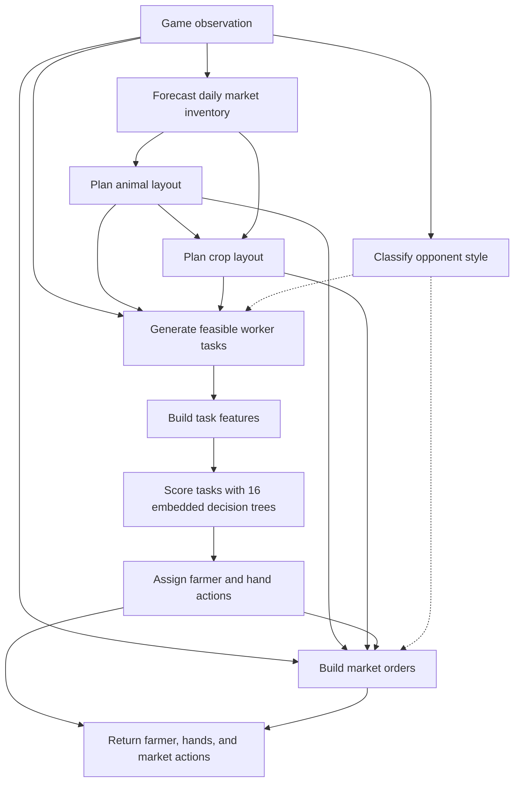
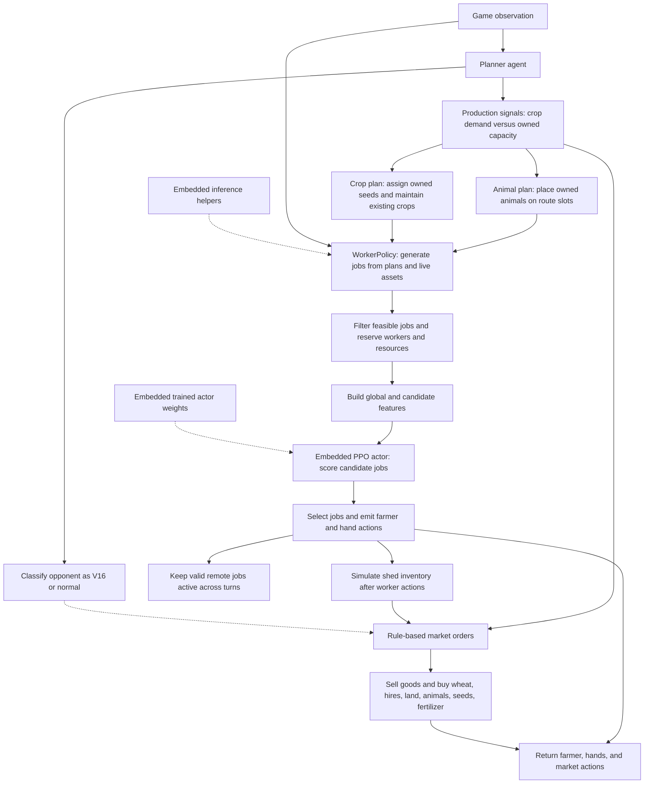

1st submission on aug 20th. game ends on Sep 30 2026.

before v16, simply use codex to generate next version by using self generated seed and play against current version for evaluation.
v16-v18, using codex and game history(loss ones) for generating next version
form v19, start to use rl for training.

system workflow structure for notebooks starting from v16:

All notebooks from v16 through v22 follow the same submission workflow: install the validation environment, write a standalone `main.py`, check its entrypoint and action contract, run file-loader validation games, build and verify `submission.tar.gz`, then submit it. Training and model selection happen outside the submission notebook; any learned policy used at runtime is embedded in `main.py`.

| notebook | structure | comments |
| --- | --- | --- |
| [v16](submission_nb/kaggriculture-sub_v16.ipynb) | Rule-based crop, animal, worker, and market planners in one self-contained agent. | developed by codex. learning materials are v15 loss cases. codex do static replay on these loss cases to improve model until reaching the goal(win all loss cases, 70%, half, etc). It shows clearly, learning from loss cases are much more effective than self-play. |
| [v17](submission_nb/kaggriculture-sub_v17.ipynb) | there is no structure change, just some improvment based on v16 | same development methods. |
| [v18](submission_nb/kaggriculture-sub_v18.ipynb) | no structure change, just some improvment based on v17, added an embedded learned tree model for worker-task scoring. | same development methods. |
| [v19](submission_nb/kaggriculture-sub_v19.ipynb) | no structure change, just changes `HERD_THRESHOLD` from 500 to 200, performance is roughly the same as v18 in kaggle | attempt to apply RL ppo, see local_arena/v19_rl, but kind of immature usage and training. the change of `HERD_THRESHOLD` is merely the result of immature training |
| [v20](submission_nb/kaggriculture-sub_v20.ipynb) | structure is same as v19, only adds an embedded residual Double-DQN model to rank worker tasks. | another attempt to apply RL deep qlearning, see local_arena/v20_rl,Uses the selected `update_0009.pt` checkpoint |
| [v21](submission_nb/kaggriculture-sub_v21.ipynb) | Extends v20's planner and residual worker-task scorer with a revised production forecast. | Focuses on forecast changes for v20 loss cases. |
| [v22](submission_nb/kaggriculture-sub_v22.ipynb) | Heavily Reorganized crop, animal, and market planner with an embedded deterministic PPO worker policy and actor weights(using v25_rl\runs\worker_ppo_static_v20_v13_plant_signal\checkpoints\best.pt for v22 with commit ceb2acbf3ee14a210c7ee3a01ac2a0c93c6e688f). | Another attempt to apply, see local_arena\v25_rl, The notebook's internal title is `v25_rl`; the filename remains v22. |

### v19 structure graph

The embedded trees rank worker tasks; animal and crop planning remains rule-based. The v19 animal planner uses `HERD_THRESHOLD=200` when deciding whether to expand the herd.

### v22 structure graph

The notebook packages the planner, worker policy, inference helpers, and actor weights into one standalone `main.py`. The PPO actor selects worker jobs; the production plans and market purchases remain rule-based. Market orders follow worker actions so they can account for the resulting shed inventory.

v22 is new reorganized version, which has clear structure 
v22 is submitted to kaggle on Sep30th, and loses terribly(as of writing, Oct 1st 2026, gets only 439.1), its rl part(for worker actions) is based on best.pt(commit sha:ceb2acbf3ee14a210c7ee3a01ac2a0c93c6e688f, commited on Sep 30th)

--------------------------------------------------------------------------------------------------------------------------------------
what to do afterwards,
keep training rl model for worker action,
study reward design to make training faster and make agent behavior as intended,
study rl methods ppo, q, deep rl, agentic rl training,
setup systemic, engineered way to generate in-time feedback on how the training system works(aka, effective observality and reaction to improve training system),
training platform to faciliate distirbuted rl trainig,
training platform to faciliate distirbuted rl trainig + distributed ml/dl trainng,
